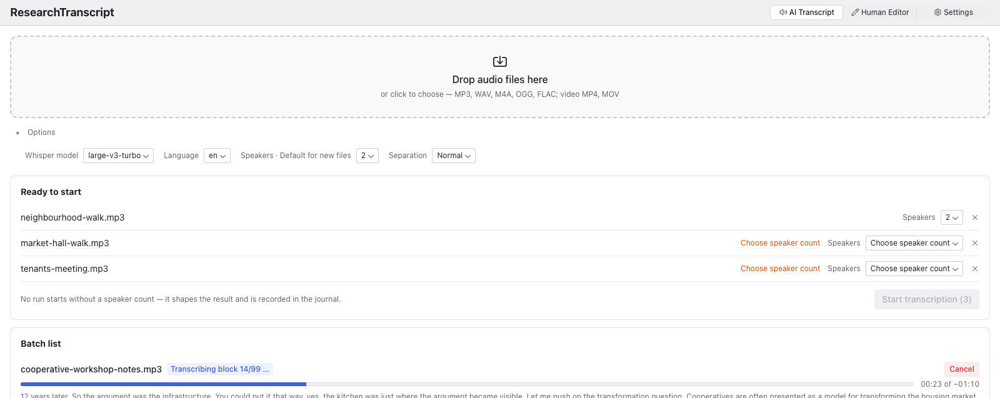
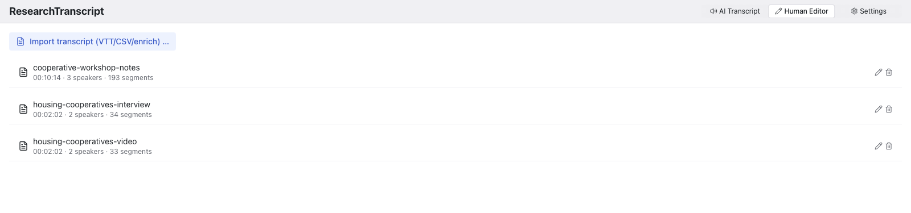
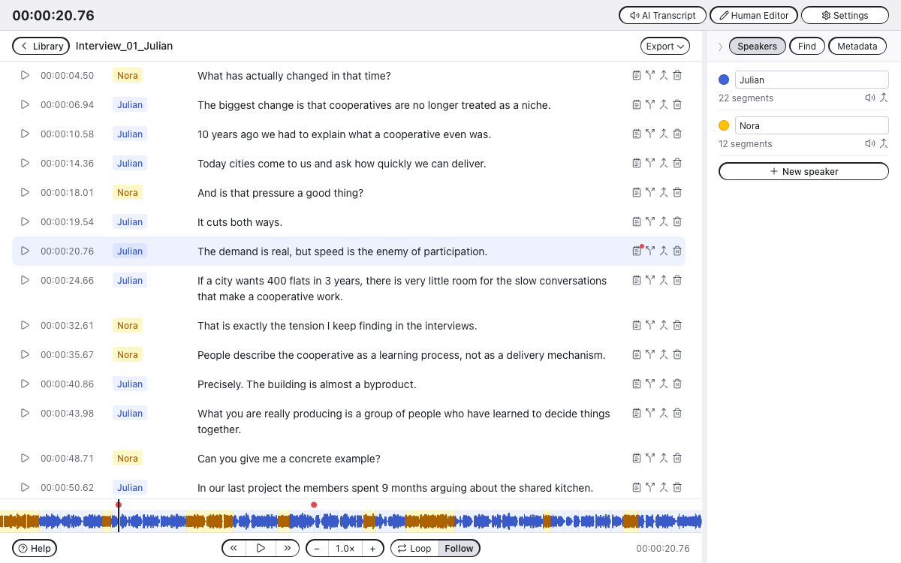
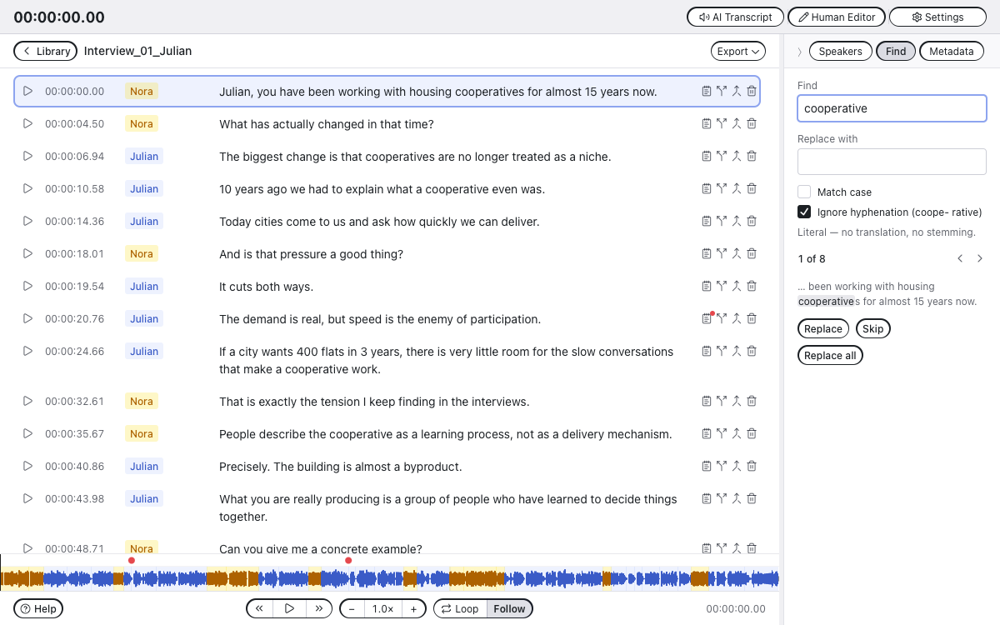
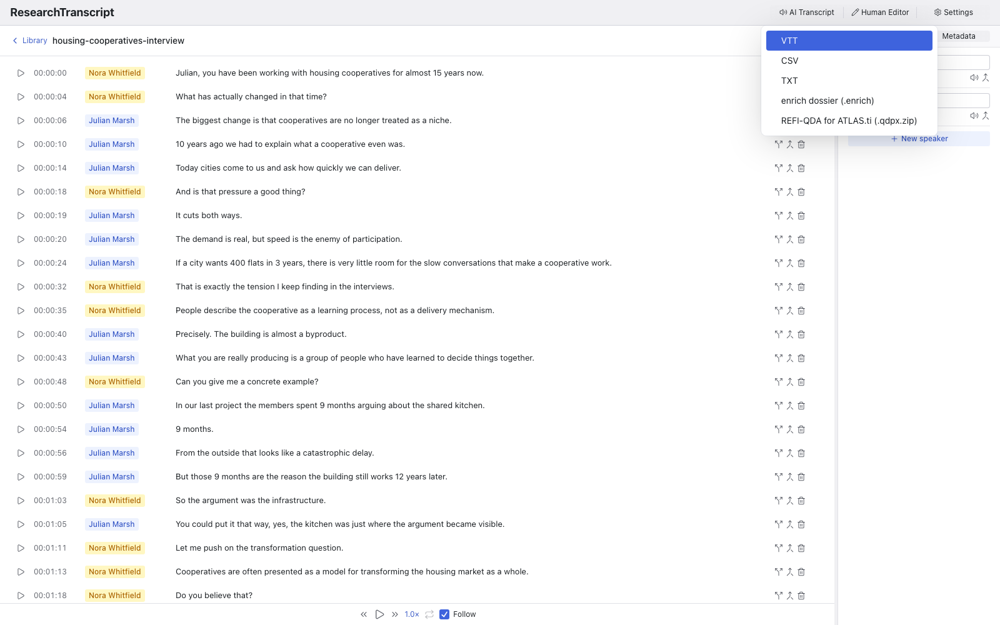
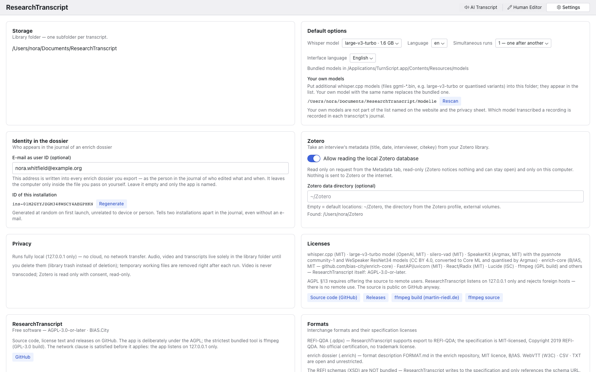

# ResearchTranscript

> **Formerly LocalTranscript, briefly TurnScript.** Renamed in September
> 2026 because other transcription apps use similar names. Version
> counting restarts at 0.4.0, in line with the other B/IAS tools.
> ResearchTranscript starts fresh: it does not take over the settings of
> earlier versions, and on first launch you choose the library folder —
> an existing library can simply be picked there. Transcripts and
> dossiers written by the earlier versions are read as its own, and
> REFI-QDA exports keep their identifiers. Old links redirect.

A native macOS app for **fully local** audio transcription with speaker
diarisation. Whisper runs on your machine, the diarisation runs on your
machine, and nothing is ever uploaded. Built at **B/IAS — Basel
Institut für angewandte Stadtforschung** as a [Tauri](https://tauri.app)
app with the enrich UI kit, and it exports straight into
[enrich](https://github.com/bias-city/PDFenrichCLI) and into
REFI-QDA for ATLAS.ti.

- **Transcription:** [whisper.cpp](https://github.com/ggerganov/whisper.cpp)
  (Metal), `large-v3-turbo` bundled.
- **Diarisation:** SpeakerKit (Argmax, MIT) running pyannote
  community-1 on Core ML — no Hugging Face token, no account, no network.
- **Interface:** German, English, French, Italian.
- **No server:** since 0.5.0 the Python logic runs *inside* the app
  process (embedded CPython 3.13 via PyO3); the interface calls it
  through Tauri commands. No port, no HTTP, no child interpreter. The
  loopback server (`127.0.0.1:5628`, `LOCT` on a phone keypad) exists
  only for browser development and the tests.

> The screenshots below use an **invented** two-person interview about
> housing cooperatives, synthesised with macOS `say`. No real research
> material is shown anywhere in this repository. The file itself is in
> [`docs/demo/`](docs/demo/) — 2:02 min, two speakers — so the run can be
> reproduced without recording anything first.

## Transcribe

Drop audio files (MP3, WAV, M4A, OGG, FLAC) onto the *AI Transcript*
tab. Each file becomes a job with a live block counter, the text that is
being recognised right now, and elapsed / estimated time.

Files run **one after another** by default — a second GPU job does not
make the first one faster. *Simultaneous runs* in the settings raises
that to at most four; the queue keeps the order in which files were
dropped, and a waiting job can still be cancelled.



The bundled models are `large-v3-turbo` and `medium`. Any other
whisper.cpp model — a Swiss German fine-tune, a quantised variant —
goes into the library's `Modelle` folder and appears in the model list;
see *Your own models* under Settings below. The app never downloads.

The *Speakers* option is an exact count, not a range: `1` means no
separation and everything ends up as one speaker, `2`–`6` force exactly
that many, `Automatic` lets the clustering decide. *Separation* sets how eagerly voices are
split apart.

## A library, not a pile of files

Every transcript is one folder holding the canonical
`transkript.json` — speakers as entities, segments with stable ids —
plus the audio, `history/` snapshots written on every save, and the
derived exports. Deleting moves to a library trash; nothing is
destroyed.



## Video

An MP4/MOV/M4V with H.264 or HEVC is accepted wherever audio is — in
the batch list and as the audio of an import. The sound track is
extracted to mp3 (the working copy for Whisper and the editor); the
video file is stored unchanged in the entry and never transcoded. The
only limit is 10 GB per file; other containers and codecs (webm/VP9,
mkv, AVI, MPEG-2, AV1) are refused with a hint to export as H.264/MP4
externally, for instance with HandBrake or QuickTime. In the editor
the picture sits under the speakers in the side panel, muted and
without controls: the audio player leads, the picture follows — at 2×
and during jumps it freezes and blurs until it has caught up. Faces
are personal data; the privacy sheets say what that means for storage
and export. The REFI-QDA export offers “with video” (`VideoSource`,
video in the Media folder); the enrich dossier carries the sound only.

## Edit

Click an entry to open the editor. Autosave, speaker rename / merge /
reassign, an audio sample per speaker, split, join and delete segments,
and a player that follows the text. Timecodes are always `hh:mm:ss`.



Keyboard, outside the text fields: `J` / `K` / `L` shuttle back, pause
and forward the way Audition does — `←` `→` and Space do the same;
`↑` / `↓` walk along the segments and put the playhead on the start of
each one. With `⌥` held, `J` / `K` / `L` also work **while typing**.
`Ctrl+L` toggles the loop, `Ctrl+X` cycles the playback speed.

### Metadata from Zotero

The side panel has a third tab, **Metadata**. If you keep your
interviews in Zotero, link the transcript to its Zotero item: search by
title, year, name or citekey (interviews come first), choose which
people go into the transcript by role — the interviewee is not
preselected, so a pseudonymised transcript does not get their name
through Zotero — and link. Title, date, interviewer and citekey then
appear on page 1 of the `.enrich` export and travel as the layer
`source/zotero.json`. ResearchTranscript reads Zotero only on request,
read-only (Zotero can stay open) and only after you enable it in
Settings; nothing is sent to Zotero or the network.

## Find and replace

The second tab in the side panel searches **literally** — no
translation, no stemming, no fuzzy matching. It counts the occurrences,
rings the segment it is currently on, and shows the match in its
context. *Replace* changes one and moves on, *Skip* leaves one alone,
*Replace all* does the rest.

*Ignore hyphenation* additionally finds words that a transcript broke
across a line, so searching `cooperative` also finds `coope- rative`.



## Export



- **VTT** — WebVTT with standard voice tags `<v Name>`.
- **CSV**, **TXT** — plain derived text.
- **enrich dossier (`.enrich`)** — one uncompressed file in Format 2
  of the enrich dossier (`FORMAT.md` in the enrich repository): the
  transcript as the source with `origin` on every segment and speaker,
  the audio as mp3, the Zotero metadata if linked, and a manifest —
  written with enrich-core's own models — that inventories every file
  with its hash and carries the chained journal of who wrote what and
  when. No PDF: enrich typesets the reading copy itself on import
  (FORMAT.md §5), so the container stays small. Import it into enrich
  directly.
- **REFI-QDA for ATLAS.ti (`.qdpx.zip`)** — the transcript as a
  `TextSource` *and* as the `Transcript` of an `AudioSource` with one
  `SyncPoint` per utterance, speakers as codes. Verified against a
  project exported from ATLAS.ti 25.

## Import — and the two steps for VTT

*Import transcript* in the Human Editor takes a transcript that was
made elsewhere and turns it into a library entry.

**A `.enrich` is one step.** It is one file — a zip like `.docx` —
that already carries its audio, so the app takes the transcript and
the audio out of it and is done; the origin flags and the journal come
along, and a container whose files no longer match their hashes is
refused. The same works for a dossier
folder as enrich keeps it (a package on macOS): pick it or drop it. Everything else in the dossier is dropped on purpose: after the
first edit no analysis layer would line up with the text any more.

**A `.vtt` or `.csv` is two steps**, because those formats hold text and
timecodes but no sound:

1. **Pick the transcript.** A file dialog opens for `.vtt` / `.csv`
   (and `.enrich`, including the `.enrich.zip` of earlier versions).
2. **Pick the matching audio.** A second dialog asks for the `mp3` that
   belongs to it — *Cancel* if there is none. Without audio the entry
   still works; you simply edit text against timecodes and hear
   nothing.

If you skip the second step, the app looks for an audio file sitting
next to the transcript with the same name (`interview.vtt` →
`interview.mp3`) and takes that. So a matching pair in one folder
imports in one step after all.

## Handing a transcript to a colleague

The same `.enrich` does both jobs: it feeds enrich, and it hands a
transcript to someone else who continues in their own Human Editor.
Text and audio travel together in one file, the timecodes stay exact,
and nothing is lost on the way out or back in.

## Settings



Storage location, default model and language, interface language,
simultaneous runs — and

**Your own models.** The library has a `Modelle` folder. Put any
whisper.cpp model there (`ggml-*.bin` — large-v3-turbo, a quantised
variant, a fine-tune converted with whisper.cpp's converter) and it
appears in the model list, marked as your own; a file with the same
name as a bundled model replaces it. The app never downloads models.
A Hugging Face fine-tune is converted with `scripts/hf-nach-ggml.py`
(whisper.cpp's converter, with the token table written by id — needed
for models with a retrained tokenizer such as CrisperWhisper).
Files are checked (ggml magic, finished copying) before they are
offered, and Settings names what was ignored and why. Settings also
show the full list of bundled components with their
licences, the interchange formats with theirs, and the links to the
sources. The same texts appear in the *About ResearchTranscript* dialog in
the app menu.

## Documentation

- **This file** — what the app is and does, architecture, development,
  building, licences.
- **[`site/`](site/)** — the project website: a static package with no
  cookies, no dependencies and no build step (fonts and screenshots in
  their own folders), carrying the user guide in German, English,
  French and Italian.
- **[CHANGELOG.md](CHANGELOG.md)** — version history. The GitHub release
  notes are the matching section from it; changes belong here first, not
  in the release form.
- **In the app** — Settings and the About dialog carry the storage
  location, formats, bundled tools and their licences, in four
  languages.

## Architecture

```
backend/    Python ≥3.12 (uv): FastAPI, whisper-cli wrapper,
            diarisation, library, exports
            └─ src/localtranscript/enrich_export/  vendored enrich
               building blocks (drift-guard test) + Recursive fonts (OFL)
frontend/   React 18 + TS + Vite, Radix Themes, enrich kit
            (components/ui.tsx), i18n de/en/fr/it
            └─ src-tauri/   shell: spawns the backend, save dialogs
scripts/    bundle-resources.mjs (python runtime, whisper-cli, ffmpeg,
            model, venv → src-tauri/resources)
            sign-resources.mjs, notarize-dmg.mjs
```

The shell is deliberately dumb: config, library and jobs belong to the
backend. A backend already running in a terminal is used as it is and
never touched; the app only shuts down what it started itself.

## Development

Requirements: macOS on Apple Silicon, uv, Node 18+, Rust/cargo,
`brew install whisper-cpp ffmpeg`, and `ggml-large-v3-turbo.bin` under
`models/` or `~/whisper-models/` (or `LT_MODELS_DIR`). An **enrich
checkout as a sibling** (`../enrich`) — enrich-core is a path dependency
of the `.enrich` export.

```bash
cd backend && uv sync && uv run pytest          # backend + tests
cd frontend && npm install
npm run dev                                      # browser dev (proxy :5628)
uv run uvicorn researchtranscript.main:app --port 5628    # in backend/ (dev server only)
node scripts/bundle-resources.mjs                # once: runtime + python/site-packages
PYO3_CONFIG_FILE=$PWD/src-tauri/pyo3-config.txt npx tauri dev   # app dev (Python in-process)
```

## Building the bundle

```bash
node scripts/bundle-resources.mjs   # runtime/binaries/model + venv
node scripts/sign-resources.mjs     # 250 executables: Developer ID
cd frontend && npx tauri build      # .app + .dmg, shell sealed
```

**The order is mandatory.** Tauri signs the shell and the main binary
only; the bundled executables (python3, whisper-cli, ffmpeg,
argmax-cli and the libraries) would otherwise keep the linker's ad-hoc
signature — and
Apple's notary service rejects those, after the 1.9 GB upload.
`sign-resources.mjs` signs them with the Developer ID, hardened runtime,
entitlements and a timestamp (55 s); the signature lives inside the
Mach-O and survives being copied into the bundle.

The entitlements in `frontend/src-tauri/entitlements.plist` are not
negotiable: without `disable-library-validation` the app does not start
after signing, because Python loads `.so` files carrying a foreign
signature.

Everything in one call (needs an app-specific password from
appleid.apple.com):

```bash
export APPLE_ID=…  APPLE_PASSWORD=…  APPLE_TEAM_ID=CCRJ4A42D3
cd frontend && npm run release
spctl -a -vv /Applications/ResearchTranscript.app   # → Notarized Developer ID
```

`npm run release` chains the steps: stage the resources, sign the
executables, `tauri build --bundles app` *without* the `APPLE_*`
variables (signature only), `notarize-app.mjs` (submit with a two-hour
timeout, staple), `build-dmg.mjs` (hdiutil + codesign) and finally
`notarize-dmg.mjs`. Notarisation used to run inside `tauri build`;
its internal wait expired on a slow Apple queue and took the whole
build with it, so it lives in its own step now.
Without that step Gatekeeper reports "Unnotarized Developer ID" when the
downloaded image is opened, even though the app inside it is clean. If
the ticket is already stapled the script does nothing and saves the
1.8 GB upload.

`bundle-resources.mjs` takes the python runtime, whisper-cli/dylibs and
models from a v1 checkout sitting next to this one
(`../whisper-web/electron/resources`) and builds the venv fresh. The
dossier reader/writer comes from the public package
[enrich-core](https://github.com/bias-city/enrich-core) (MIT), pinned
to a tag in `backend/pyproject.toml` — the same code the tests run
against.
**ffmpeg**: a redistributable GPL static build from
<https://ffmpeg.martin-riedl.de> (macos/arm64/release) →
`frontend/src-tauri/resources/bin/ffmpeg`; the script refuses nonfree
builds (the v1 binary declared itself "not legally redistributable").
For GPL §6 compliance, attach the build and source links to the GitHub
release.

## Interchange formats and their licences

**REFI-QDA (`.qdpx.zip`).** ResearchTranscript *supports export to REFI-QDA*.
The specification is under the **MIT licence, Copyright 2019 REFI-QDA**
(<https://www.qdasoftware.org/>). There is no official certification for
REFI-QDA, and the MIT licence of the specification does not cover
trademarks — no such claim is made here. The REFI schemas (XSD) are
**not** bundled: ResearchTranscript writes to the specification and only
references the schema URL, so the MIT attribution requirement does not
apply.

**enrich dossier (`.enrich`).** The format is described in
`FORMAT.md` — Format 2, which enrich and ResearchTranscript write today,
and Format 1 for reading — and implemented by the reference package
[enrich-core](https://github.com/bias-city/enrich-core), both under
the **MIT licence** (B/IAS).

**WebVTT** (W3C) · **CSV** · **TXT** are open and unrestricted.

## Licence

**AGPL-3.0-or-later** (BIAS.City), by choice. Up to 2.2.0 the licence
was also forced by PyMuPDF (AGPL-3.0), which typeset the dossier PDF;
since 2.3.0 the enrich export carries no PDF (enrich typesets the
reading copy itself on import, FORMAT.md §5), so PyMuPDF and the
Recursive fonts are no longer bundled. The strictest bundled tool is
now ffmpeg (GPL-3.0 build); GPLv3 and AGPLv3 are compatible (GPLv3
§13).

**Texts and images are CC BY 4.0.** The website in `site/`, the eight
sheets in `site/docs/`, this README, the changelog and the backlog may
be used and adapted, commercially too, as long as B/IAS is named and
changes are marked — see `LICENSE-docs`. That is deliberate: the sheets
exist to be pasted into an ethics application or a data management
plan. The code stays AGPL-3.0-or-later, and the Recursive font on the
website stays SIL OFL 1.1.

**The network clause is satisfied before it applies:** ResearchTranscript
is not a network service — the logic runs inside the app process, and
the only listener, the development server in `main.py`, binds to
`127.0.0.1` and turns everything foreign away with 421 — there is no
remote use in the sense of §13. The source is public anyway; the "Source code (GitHub)" button
in the About dialog is the offer inside the app itself.

Bundled, among others: whisper.cpp (MIT), large-v3-turbo model (OpenAI,
MIT), silero-vad (MIT), SpeakerKit (Argmax, MIT) with the pyannote
community-1 and WeSpeaker ResNet34 models (CC BY 4.0, converted to
Core ML and quantised by Argmax), enrich-core (B/IAS, MIT), CPython 3.13 (PSF), pydantic (MIT), React/Radix (MIT), Lucide (ISC), ffmpeg
(GPL-3.0 build, `--enable-gpl --enable-version3`) — the complete list is
in the settings.
